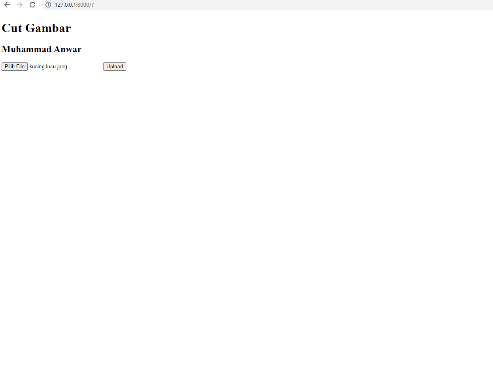
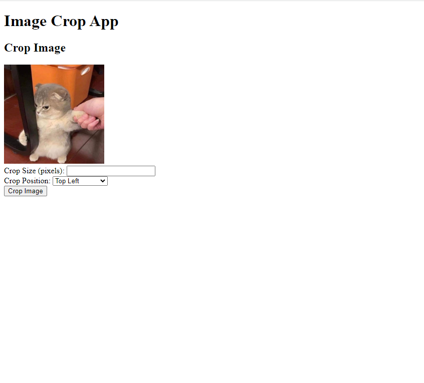
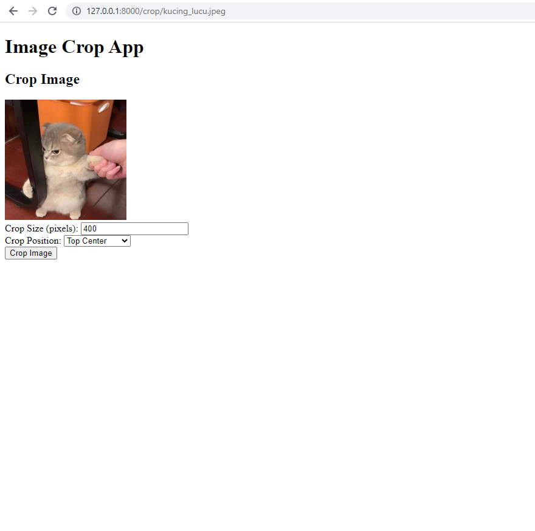
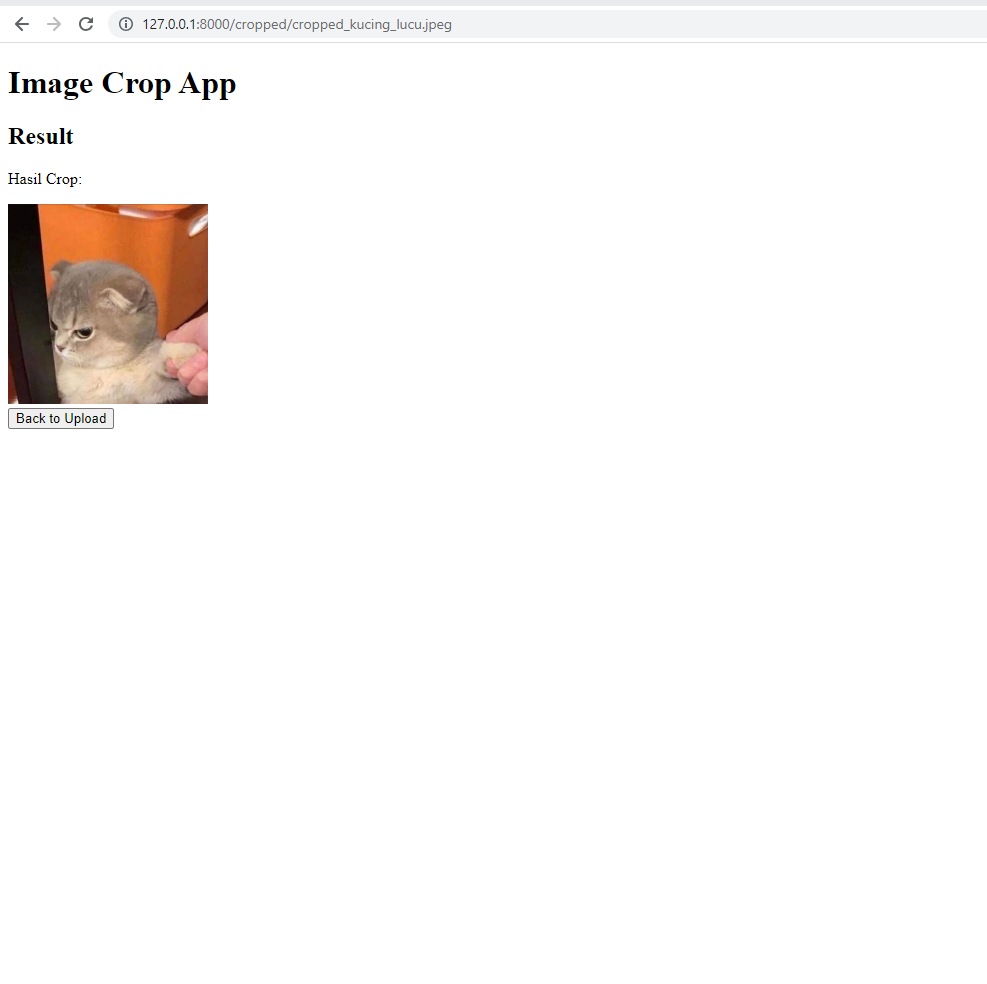

# Tugas Uas

Nama    : Muhammad Anwar

## Cara kerja
Berikut adalah cara menggunakan Web App Cut Image:

### Upload Gambar

Pertama-tama upload gambar dari halaman di atas.
Setelah itu pilih file gambar berupa .jpg atau .png lalu klik submit. sehingga gambar diupload dan dapat ditampilkan.

setelah menekan tombol upload gambar akan di tampilkan seperti ini.

lalu masukkan size, dan plih posisi gambar misal `top_center` dan size nya 400px
 

lalu outputnya kira-kira seperti ini.
Akan tampil gambar sesuai dengan posisi dan ukurannya.